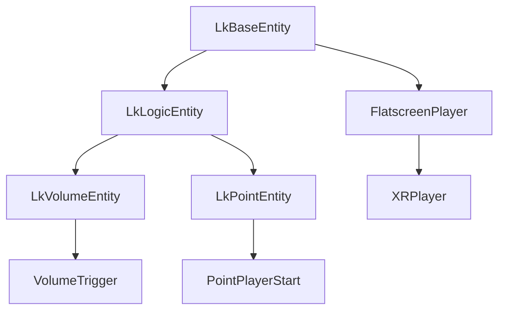

# Entity Hierarchy

The entity system in Likeum is inspired by how id Software accomplished with their idTech engine.

> Because Likeum relies on the Godot Engine, everything still revolves around Godot's Node hierarchy. But this article
> will omit that and only talk about the Likeum entities.

> Entities prefixed with **Lk** are not meant to be used in-game!

## Complete Entity Hierarchy
