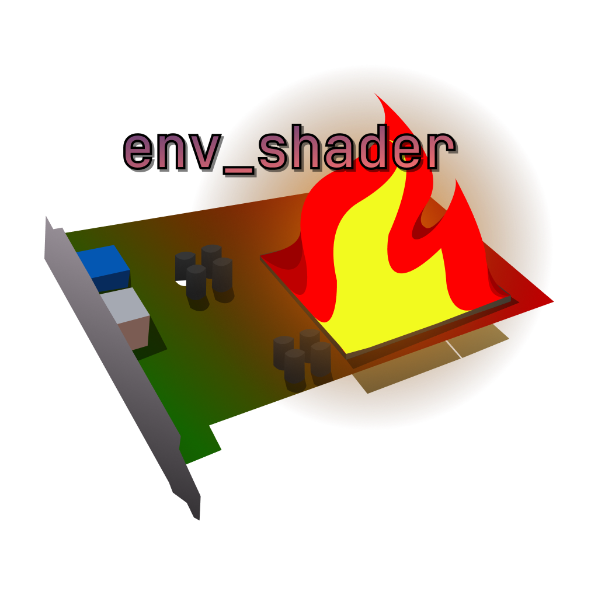

# Enviroment Shader



This entity is for applying custom or built-in screen effects during gameplay.
<br/>Shaders are written in [GLSL](https://registry.khronos.org/OpenGL/specs/gl/GLSLangSpec.4.40.pdf)

### How do I use it?

Just insert env_shader into your map and fill in the shader path then add the env_shader to the targets of 
your trigger or spawn trigger

Here is an example of a custom screen shader.

```GLSL
niggers
```